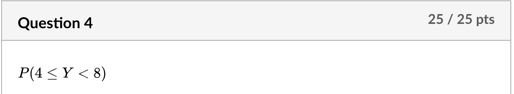
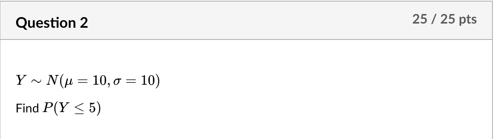
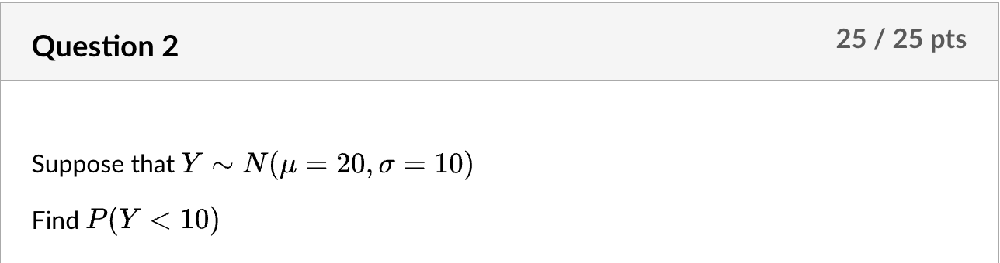

```{r setup, include=FALSE}
knitr::opts_chunk$set(echo = TRUE)
```

```{r}
ddt <- read.csv("DDT.csv")
```

# Wrangling Data
## Question 1

```{r}
mean_weight <- mean(ddt[ddt$SPECIES == 'SMBUFFALO',]$WEIGHT)
mean_weight
```

## Question 2

```{r}
mean_length <- mean(ddt[ddt$DDT > 33 & ddt$SPECIES == 'CCATFISH',]$LENGTH)
mean_length
```

## Question 3

```{r}
std <- sd(ddt[ddt$SPECIES == 'LMBASS' | ddt$SPECIES == 'SMBUFFALO',]$DDT)
std
```

## Question 4

```{r}
num <- nrow(ddt[ddt$LENGTH > 40 & ddt$WEIGHT > 1000,])
num
```

# Sub Setting Using "["

## Question1

```{r}
ddt[1, 2]
```

## Question 2

```{r}
num_bass <- nrow(ddt[ddt$LENGTH > 30 & ddt$SPECIES == 'LMBASS',])
num_bass
```

## Question 3

```{r}
num_fish <- nrow(ddt[ddt$LENGTH > 49 & ddt$LENGTH < 50,])
num_fish
```

## Question 4

```{r}
num_fish <- nrow(ddt[ddt$LENGTH > 49 & ddt$WEIGHT < 1200,])
num_fish
```

# Chapter 2: Z Transformations

## Question 1


## Question 2

```{r}
z_weight <- scale(ddt$WEIGHT)

outliers <- ddt[abs(z_weight) > 3,]
outliers
```

## Question 3

```{r}
outliers <- ddt[abs(z_weight) > 2 & abs(z_weight) < 3, ]
min_weight_outliers <- min(outliers$WEIGHT)
min_weight_outliers
```

## Question 4


# Chapter 3: Tables
```{r}
data <- read.csv("MTBE.csv")
tab <- with(data, table(WellClass, `MTBE.Detect`))
addmargins(tab)
```

## Question 1


## Question 2


## Question 3


## Question 4


# CH3: Create The Table and Answer
```{r}
data <- read.csv("MTBE.csv")
tab <- with(data, table(WellClass, `MTBE.Detect`))
addmargins(tab)
```
## Question 1


## Question 2


## Question 3


## Question 4


# Tables and R
```{r}
seeds <- read.csv("SEEDLING.csv")
tt <- table(seeds$Abundance, seeds$Type)
att <- addmargins(tt)
att
```

## Question 1


## Question 2


## Question 3


## Question 4


# DP Stem R Functions


## Question 1

```{r}
p_y_equals_6 <- dbinom(6, size = 10, prob = 0.6)
p_y_equals_6
```

## Question 2

```{r}
p_y_greater_5 <- 1 - pbinom(5, size = 10, prob = 0.6)
round(p_y_greater_5, 4)
```

## Question 3

```{r}
p_y_between_3_and_7 <- pbinom(7, size = 10, prob = 0.6) - pbinom(2, size = 10, prob = 0.6)
round(p_y_between_3_and_7, 4)
```

## Question 4

```{r}
p_y_between_4_and_7 <- pbinom(7, size = 10, prob = 0.6) - pbinom(3, size = 10, prob = 0.6)
round(p_y_between_4_and_7, 4)
```

# The Normal

## Question 1

```{r}
p_value <- 1 - pnorm(20, mean = 20, sd = 6)
p_value
```

## Question 2

```{r}
pnorm(5, mean = 10, sd = 10)
```

## Question 3

```{r}
1 - pnorm(0.5, mean = 0, sd = 1)
```

## Question 4

```{r}
pnorm(20, mean = 20, sd = 10) - pnorm(10, mean = 20, sd = 10)
```

# Normal, p and q
## Question 1

```{r}
qnorm(0.6, mean = 10, sd = 4)
```

## Question 2

```{r}
pnorm(10, mean = 20, sd = 10)
```

## Question 3

```{r}
qnorm(0.55, mean = -8, sd = 5)
```

## Question 4

```{r}
pnorm(1000, mean = 10000, sd = 5)
```

# Pnorm
## Question 1

```{r}
pnorm(8, mean = 10, sd = 5) - pnorm(3, mean = 10, sd = 5)
```

## Question 2

```{r}
1 - pnorm(11, mean = 10, sd = 5)
```

## Question 3

```{r}
pnorm(2, mean = 10, sd = 5)  # Should always be zero
```

## Question 4

```{r}
pnorm(10, mean = 10, sd = 50)
```


